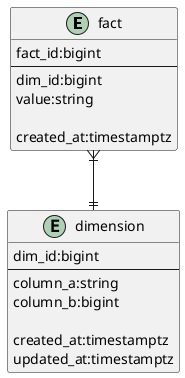

# BigQuery Data Model Mockup

```plantuml

@startuml bigquery.dw

skinparam Linetype ortho

entity "fact" as fact {
    fact_id:bigint
    --
    dim_id:bigint
    value:string

    created_at:timestamptz
}

entity "dimension" as dimension {
    dim_id:bigint
    ---
    column_a:string
    column_b:bigint

    created_at:timestamptz
    updated_at:timestamptz
}

fact }|--|| dimension

@enduml
```

